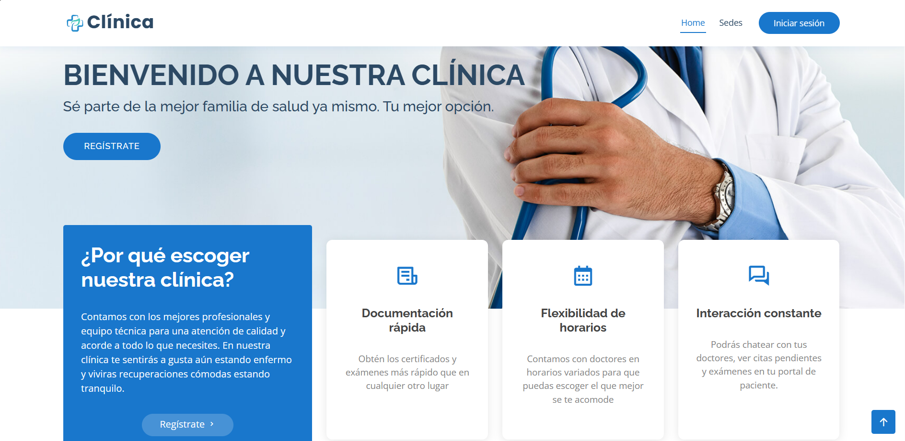
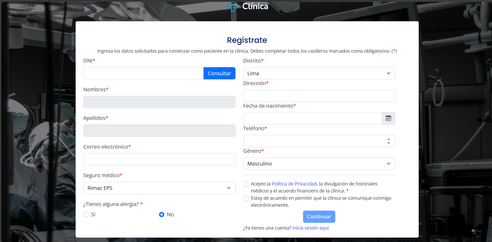
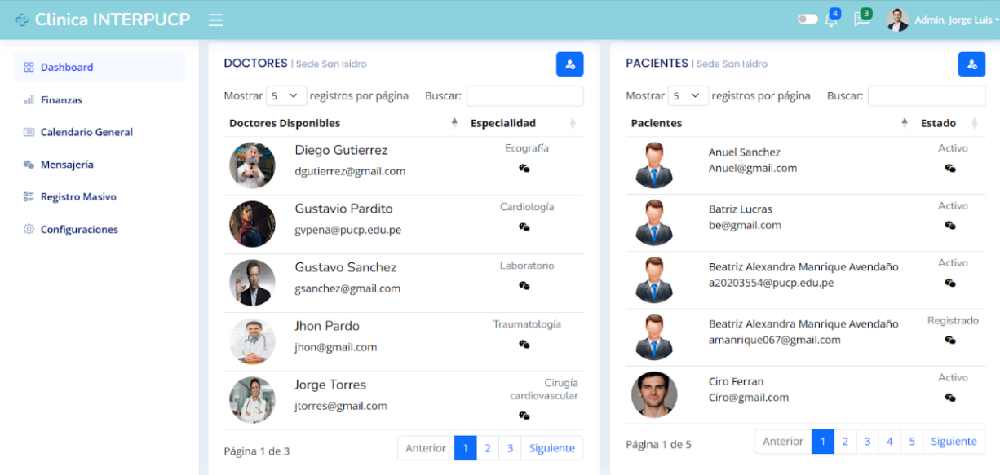
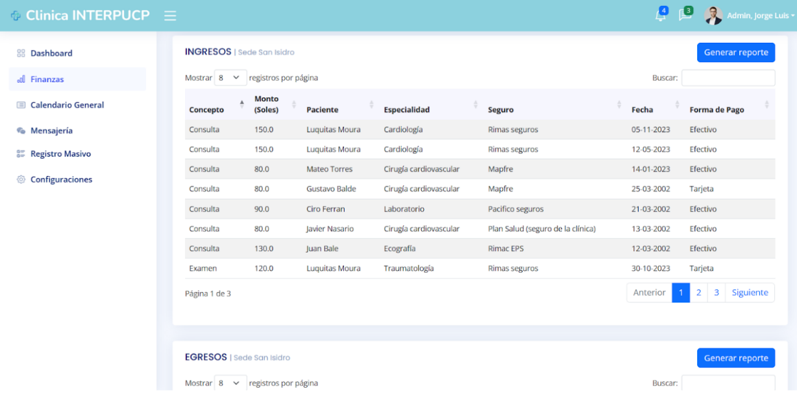
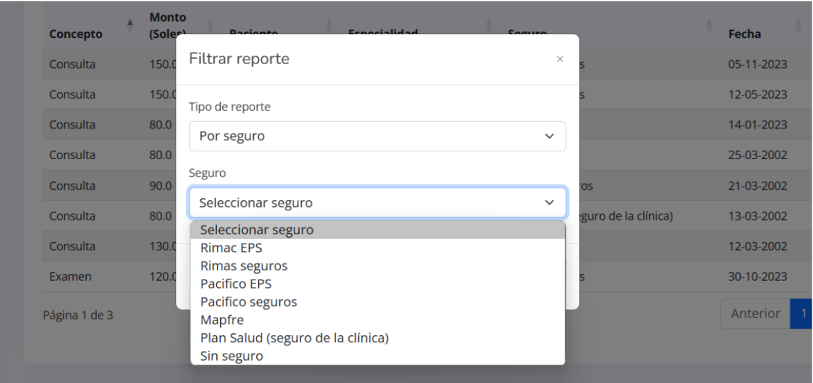

# Clinica_InterPUCP
Un proyecto desarrollado con el objetivo de registrar y administrar las sedes de una clínica. Permite la gestión de citas médicas, historial médico y citas en telemedicina. Este proyecto cuenta con 4 roles: paciente, doctor, administrador, administrativo y un superadmin.

Vista de inicio, registrarse e Iniciar sesion
 

Dasboard de administrador de sede, vista finanzas, reportes, entre otros.
 
